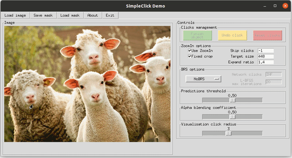

## [Prior tokenization-based interactive segmentation with Vision Transformers]


<p align="center">
  
</p>

<p align="center">
    <a href="https://opensource.org/licenses/MIT">
        
    </a>
</p>

## Environment
Training and evaluation environment: Python3.8.8, PyTorch 1.11.0, Ubuntu 20.4, CUDA 11.0. Run the following command to install required packages.
```
pip3 install -r requirements.txt
```
You can build a container with the configured environment using our [Dockerfiles](https://github.com/dzyha2011/PT-SimpleClick/tree/main/docker). 
Our Dockerfiles only support CUDA 11.0/11.4/11.6. If you use different CUDA drivers, you need to modify the base image in the Dockerfile (This is annoying that you need a matched image in Dockerfile for your CUDA driver, otherwise the gpu doesn't work in the container. Any better solutions?).
You also need to configue the paths to the datasets in [config.yml](https://github.com/dzyha2011/PT-SimpleClick/blob/main/config.yml) before training or testing.

## Demo
<p align="center">
  
</p>

An example script to run the demo. 
```
python3 demo.py --checkpoint=./weights/pt-simpleclick_models/prior_tokenize_cross_attention_cl_large.pth --gpu 0
```
Some test images can be found [here](https://github.com/dzyha2011/PT-SimpleClick/tree/main/assets/test_imgs).

## Evaluation
Before evaluation, please download the datasets and models, and then configure the path in [config.yml](https://github.com/dzyha2011/PT-SimpleClick/tree/main/config.yml).

Use the following code to evaluate the large model.
```
python scripts/evaluate_model.py NoBRS \
--gpu=0 \
--checkpoint=./weights/pt-simpleclick_models/prior_tokenize_cross_attention_cl_large.pth \
--eval-mode=cvpr \
--datasets=GrabCut,Berkeley,DAVIS,PascalVOC,SBD,COCO_MVal,ssTEM,BraTS,OAIZIB
```

## Training
Before training, please download the [MAE](https://github.com/facebookresearch/mae) pretrained weights (click to download: [ViT-Base](https://dl.fbaipublicfiles.com/mae/pretrain/mae_pretrain_vit_base.pth), [ViT-Large](https://dl.fbaipublicfiles.com/mae/pretrain/mae_pretrain_vit_large.pth), [ViT-Huge](https://dl.fbaipublicfiles.com/mae/pretrain/mae_pretrain_vit_huge.pth)) and configure the dowloaded path in [config.yml](https://github.com/uncbiag/SimpleClick/blob/main/config.yml).

Use the following code to train a huge model on C+L: 
```
python train.py models/iter_mask/plainvit_base448_cocolvis_itermask.py \
--batch-size=32 \
--ngpus=4
```

## Download 
PT-SimpleClick models: [Google Drive](https://drive.google.com/file/d/1b0uV48HglmF22ktf-KaDzxyouZYvwF5v/view?usp=drive_link)

BraTS dataset (369 cases): [Google Drive](https://drive.google.com/drive/folders/1B6y1nNBnWU09EhxvjaTdp1XGjc1T6wUk?usp=sharing) 

OAI-ZIB dataset (150 cases): [Google Drive](https://drive.google.com/drive/folders/1B6y1nNBnWU09EhxvjaTdp1XGjc1T6wUk?usp=sharing)

Other datasets: [RITM Github](https://github.com/saic-vul/ritm_interactive_segmentation)


## Origins
- This project is a modified version of [SimpleClick](https://github.com/uncbiag/SimpleClick/) (MIT License).


## License
The code is released under the MIT License. It is a short, permissive software license. Basically, you can do whatever you want as long as you include the original copyright and license notice in any copy of the software/source. Copyright (c) [2023] [Qin Liu/University of North Carolina at Chapel Hill]. Copyright (c) [2025] [Zongyuan Ding/Changzhou University]. 

## Citation
```bibtex
@article{ding4969882prior,
  title={Prior Tokenization Based Interactive Segmentation With Vision Transformers},
  author={Ding, Zongyuan and Wang, Boyu and Wang, Hongyuan and Tao, Wang},
  journal={Available at SSRN 4969882}
}
```
## Acknowledgement
Our project is developed based on [RITM](https://github.com/saic-vul/ritm_interactive_segmentation). Thanks for the nice demo GUI :)
